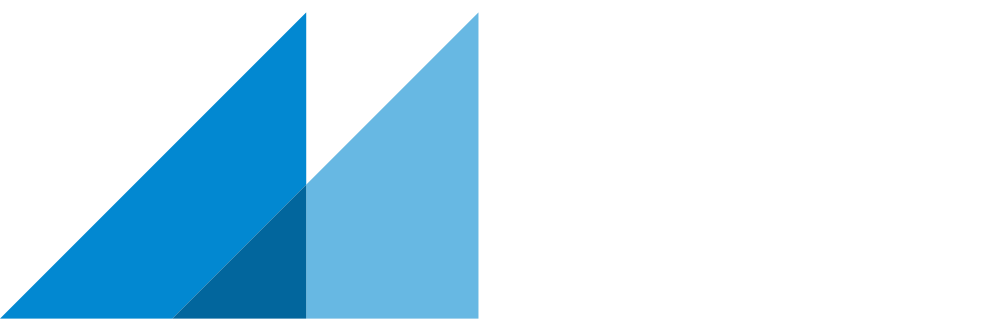

---

# Activate Marp
marp: true

# Metadata
title: RWK Presentation
description: Presentation für das RWK Projekt
author: Gabriel Torres Gamez
date: 2020-06-09

# Theme settings
theme: chef-gabo
class: invert
header: 'RWK Präsentation'
footer: 'Gabriel Torres Gamez'
color: #ffffff

# Slide settings
paginate: true

---

# RWK
Reflexion über das Portfoliomodul

---

## Behandelte Fragestellungen: 
- Vorbereitung von Bewerbungsmaterialien
- Üben von Bewerbungsgesprächen
- Präsentationstechnik

---

## Vorbereitung von Bewerbungsmaterialien
- Lebenslauf vorbereiten
- Bewerbung Universitätsklinik Balgrist
- Bewerbung Eidgenössische Materialprüfungs- und Forschungsanstalt

---

## Üben von Bewerbungsgesprächen
- Einblick über mögliche Fragen
- Kompliziertere Fragen geübt

---

## <!-- fit --> und jetzt ???

---

##### Eidgenössische Materialprüfungs- und Forschungsanstalt
- Bewerbungsgespräch ???
- Zivildiensteinsatz
- Teilzeitjob nach Zivildiensteinsatz

--- 

##### Kombination mit anderen Modulen
- Digitales Portfolio
    - Bewerbungsschreiben
    - Lebenslauf
    - Bewerbungsgespräch

---

##### Präsentation mit Marp
- Basiert auf Markdown
- VS Code Extension
- Struktur bereits vorgegeben, deswegen schneller als PowerPoint
- Export als PDF, HTML, PPTX, etc.
- Markdown Dateien auch ohne Editor lesbar

---

## Feedback zur Präsentation
Hier übergebe ich gerne dir das Wort. :)